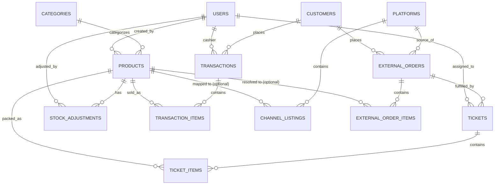

# BOZZ — Entity Relationship Diagram (Core Entities)

Source of truth: [`backend/prisma/schema.prisma`](../backend/prisma/schema.prisma).

The schema actually contains 29 Prisma models. This document covers only the
**13 core entities** that the implemented business logic (POS, marketplace
sync, product mapping, ticket packing, stock ledger, dashboard, reports)
actually reads and writes. The remaining models exist in the schema for
future/optional features (e.g. wholesale tiers, product batches, shopping
lists, expenses) and are not part of the current implementation — they are
intentionally left out here to avoid overstating what BOZZ does today.

## Diagram

## Entity Notes

| Entity | Purpose |
|---|---|
| `users` | Accounts with a role: `owner`, `kasir` (cashier), or `pengepak` (packer). Drives authorization on every protected endpoint. |
| `categories` | Product categories (optional grouping). |
| `products` | The internal BOZZ product catalog: `stock_qty`, `low_stock_threshold`, `price`, `sku`, `is_active`. |
| `customers` | Shared between walk-in POS customers and marketplace buyers (`source` field distinguishes origin). |
| `transactions` / `transaction_items` | POS sales. `transactions.status` is `completed` or `voided` — voided transactions are excluded from revenue and restore stock. |
| `stock_adjustments` | The append-only stock ledger. Every stock change (POS sale, void reversal, manual adjustment, restock, marketplace handover) is recorded here with a `reason`, `stock_before`, and `stock_after`. This is what Dashboard and Sales Report read for "recent activity" / revenue. |
| `platforms` | A connected marketplace channel (`fakestore`, `shopee`, `tiktok`, `tokopedia`). |
| `external_orders` / `external_order_items` | Orders ingested from a marketplace platform, normalized into a common shape regardless of source platform. `status` follows `new → processing → shipped → completed`, with `cancelled` reachable from any non-terminal state. |
| `channel_listings` | Maps a platform's external item id to an internal `product_id`. An `external_order_item` without a matching listing (or a listing with no `product_id` yet) stays unmapped (`product_id = null`) — it still counts toward marketplace revenue, but is excluded from stock deduction and from "Top Products" ranking, since there is no valid product to attribute it to. |
| `tickets` / `ticket_items` | The packing workflow for a marketplace order: `unassigned → assigned → packing → packed → handed_over`. Handover is the point where stock is actually deducted for mapped items. |

## Key Constraints Worth Knowing

- `channel_listings` has a unique constraint on `(platform_id, external_item_id)` — one external item maps to at most one internal product per platform.
- `stock_adjustments` is append-only and never updated/deleted by application code; it is the audit trail for every stock change.
- `transactions.status` and `external_orders.status` are separate state machines — POS sales are binary (completed/voided), marketplace orders have a multi-step lifecycle.
